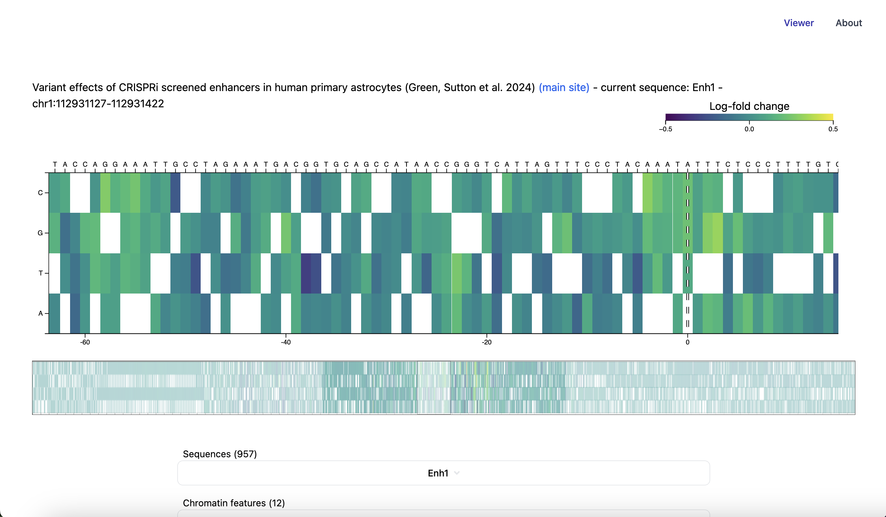

## DeepSEA Heatmap Viewer



Basic static heatmap viewer for variant expression TSV files, allows mirroring of DeepSEA/Beluga analysis performed on humanbase (Flatiron Institute). Launch [example](https://voineagulabunsw.github.io/deepsea_viewer/).

Example: (WARNING - each humanbase job id requires ~3GB storage)
```
# Install
python3 -m pip install "git+https://git@github.com/VoineaguLabUNSW/deepsea_viewer.git#subdirectory=pipeline"

# Create local folder
deepsea-viewer create -d ./export -r '^NH_A_Astrocytes.*' \
    -desc 'Variant effects of CRISPRi screened enhancers in human primary astrocytes (Green, Sutton et al. 2024) <a href="https://voineagulabunsw.github.io/astrocyte_crispri_resource/">(main site)</a>' \
    1d57acde-1d71-48c8-90d1-dcc45702a5fb \
    65fb5c0e-ae5d-41a8-9f28-90a467c0fed1 \
    b87d5aee-42d0-4a05-9c90-3a2a969a4baf \
    3172fe98-0069-43a1-9fc1-2e2e8a0a3187 \
    8fd1a2ae-3aeb-42a1-9326-d1157a8be82f \
    cd4c218a-16b0-47ea-a1a2-9d71ca48f813 \
    54bc223e-15a2-4461-9b1c-171ca42fb1ef \
    a4300dd3-05a9-45ac-8e23-57bcfc81a88e \
    f27f9f00-bfbe-4de1-ade1-d8bef56a218f \
    611cab83-06c1-4409-9002-44bccff8b0c6 \
    -m export/metadata.tsv

# Launch local folder in browser
deepsea-viewer serve -d ./export
```

You can substitute source= in the url after uploading ./export/metadata.json and ./export/data.bin to a server/cloud provider that supports range requests.
